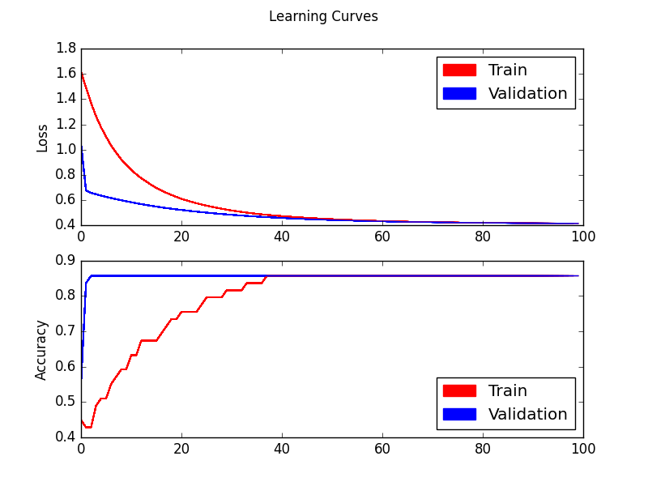

<h1> Exemples </h1>
Ce dossier présente divers exemples de résultat pouvant être obtenu.   
<ol>
  <li> LearningCurve_normal   
   
  courbe généré à partir du code first_reseau_de_neuronne.py pour 10 epoch </li>   
  
  <li> LearningCurve_black   exemple de courbe avec fond noir généré par le code first_reseau_de_neuronne pour 10 epoch </li>   
  <li> LearningCurve_retrain   courbe résultant d'un ré-entrainement d'un modèle avec utilisation d'un CSV contenant les performances </li>  
  <li> LearningCurve_retrain_epoch+1   courbe resultant d'une erreur lors d'un re-entrainement, l'epoch de depart lors du retrain représente une epoch de + que celle de fin </li>  
  <li> LearningCurve_retrain_epoch-1   courbe resultant d'une erreur lors d'un re-entrainement, l'epoch de depart lors du retrain représente une epoch de - que celle de fin </li>  
</ol>
